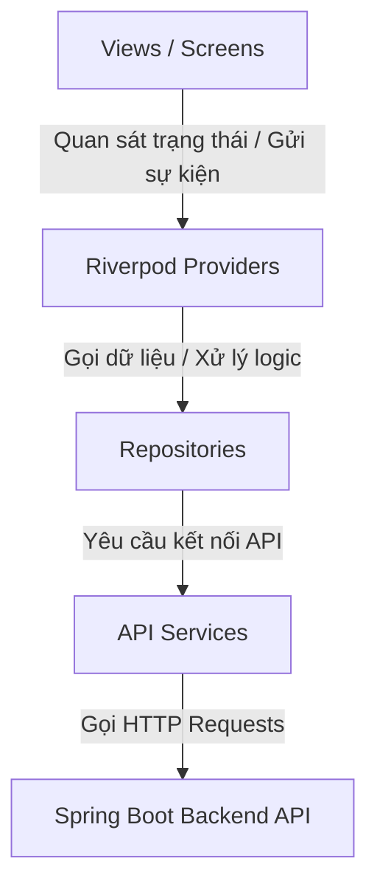

# Japanese Learning Flutter App - Project Overview & Structure

Dự án này là một ứng dụng di động học tiếng Nhật toàn diện (luyện đề thi, học từ vựng, chữ Hán, ngữ pháp và thẻ nhớ flashcards) được xây dựng bằng **Flutter**. Tài liệu này mô tả chi tiết về cấu trúc thư mục, kiến trúc thiết kế, và luồng hoạt động của mã nguồn để hỗ trợ AI/Developer nhanh chóng nắm bắt bối cảnh khi sửa lỗi hoặc phát triển tính năng mới.

---

## 1. Kiến Trúc Dự Án (Architecture Pattern)

Dự án tuân thủ kiến trúc **MVVM (Model - View - ViewModel)** hiện đại kết hợp với **Repository Pattern**, trong đó **Riverpod** chịu trách nhiệm quản lý trạng thái và đóng vai trò làm ViewModel:



*   **Model**: Định nghĩa cấu trúc dữ liệu thô nhận từ Backend API.
*   **View**: Thành phần giao diện người dùng (Widgets/Screens) phản hồi trực tiếp với các tương tác của người dùng. Lắng nghe trạng thái từ các Provider thông qua `ref.watch(provider)` và gửi các sự kiện (events) thông qua `ref.read()`.
*   **ViewModel (Riverpod Providers)**: Các lớp `Notifier` hoặc `NotifierState` trong Riverpod. Quản lý trạng thái (State) của UI và xử lý các logic tương tác độc lập với View.
*   **Repository**: Lớp trung gian điều phối dữ liệu từ local (nếu có) hoặc API Service, thực hiện ánh xạ định dạng dữ liệu (Mapping) và lọc/sắp xếp phía Client.
*   **Service**: Trực tiếp gọi API HTTP (`GET`, `POST`, ...) giao tiếp với Backend Server hoặc Firebase.

---

## 2. Cấu Trúc Thư Mục Chi Tiết (`/lib`)

Thư mục chính chứa mã nguồn Flutter nằm trong `/lib`:

```
lib/
├── data/                         # Lớp dữ liệu (Data Layer)
│   ├── models/                   # Định nghĩa các Model dữ liệu & parsing JSON
│   │   ├── auth_exception.dart   # Lỗi xác thực tài khoản
│   │   ├── comment_response.dart # Model bình luận câu hỏi đề thi
│   │   ├── exam.dart             # Model thông tin đề thi cơ bản
│   │   ├── exam_attempt.dart     # Model thông tin lượt thi của người dùng
│   │   ├── exam_detail.dart      # Model chi tiết đề thi & cấu trúc các phần thi
│   │   ├── exam_history.dart     # Model thông tin danh sách lịch sử thi
│   │   └── exam_history_detail.dart # Model chi tiết kết quả bài thi đã làm để xem lại
│   │
│   ├── repositories/             # Lớp Repository điều phối & tiền xử lý dữ liệu
│   │   ├── auth_repository.dart  # Repository tài khoản & xác thực
│   │   ├── exam_attempt_repository.dart # Repository phiên thi trắc nghiệm
│   │   ├── exam_history_repository.dart # Repository lịch sử thi & bình luận/AI Tutor
│   │   └── exam_repository.dart  # Repository lọc/sắp xếp danh sách đề thi
│   │
│   └── services/                 # Lớp Service tương tác với các nguồn bên ngoài
│       ├── auth_error_mapper.dart# Chuẩn hóa mã lỗi xác thực từ Firebase
│       ├── auth_service.dart     # Kết nối Firebase Authentication & Storage
│       ├── exam_attempt_service.dart # Gọi API bắt đầu, lưu tạm & nộp bài thi
│       ├── exam_history_service.dart # Gọi API lấy lịch sử, bình luận & hỏi AI Tutor
│       └── exam_service.dart     # Gọi API lấy danh sách & chi tiết đề thi
│
├── providers/                    # Quản lý trạng thái & logic nghiệp vụ (Riverpod Providers)
│   ├── app_setting_provider.dart # Quản lý thiết lập giao diện (Theme, kích thước chữ...)
│   ├── auth_provider.dart        # Quản lý trạng thái xác thực và thông tin người dùng
│   ├── exam_attempt_provider.dart# Quản lý tiến trình thi trắc nghiệm (câu trả lời, thời gian, audio)
│   ├── exam_history_provider.dart# Quản lý lịch sử làm bài, bình luận, báo lỗi & AI Tutor
│   ├── exam_provider.dart        # Quản lý danh sách & bộ lọc tìm kiếm đề thi
│   └── streak_provider.dart      # Quản lý dữ liệu điểm danh hàng ngày của người học
│
├── routes/                       # Quản lý điều hướng (Navigation)
│   └── app_router.dart           # Cấu hình GoRouter chính, định nghĩa AppRoutes
│
├── views/                        # Lớp hiển thị UI (Presentation Layer)
│   ├── account/                  # Các màn hình tài khoản & xác thực
│   │   ├── authen/               # Màn hình đăng nhập (login), đăng ký (register)
│   │   ├── news/                 # Màn hình danh sách tin tức & chi tiết bài báo (tích hợp audio)
│   │   └── profile/              # Trang cá nhân, thông tin cá nhân, cài đặt bảo mật, yêu thích, thống kê học tập
│   │
│   ├── exam/                     # Màn hình liên quan đến Đề thi
│   │   ├── exam_detail_screen.dart # Chi tiết đề thi (giới thiệu, cấu trúc phần thi)
│   │   └── exam_list_screen.dart   # Danh sách đề thi (hỗ trợ lọc theo loại, cấp độ, độ khó, giá cả)
│   │
│   ├── exam_attempt/             # Màn hình làm bài thi trắc nghiệm trực tiếp
│   │   └── exam_attempt_screen.dart# Giao diện thi (danh sách câu hỏi, audio nghe hiểu, gửi bài)
│   │
│   ├── exam_history/             # Lịch sử và xem lại kết quả làm bài thi
│   │   ├── exam_history_selector_screen.dart # Danh sách các bài thi đã làm
│   │   └── exam_history_review_screen.dart   # Xem lại chi tiết bài làm, giải thích, bình luận, hỏi AI Tutor
│   │
│   ├── flashcard/                # Hệ thống học từ vựng qua thẻ nhớ Flashcards
│   │   ├── create_flashcard_screen.dart # Tạo bộ thẻ mới (hỗ trợ nhập Excel/CSV)
│   │   ├── my_sets_screen.dart     # Danh sách các bộ thẻ của tôi
│   │   ├── quiz_screen.dart        # Màn hình trắc nghiệm ôn tập bộ thẻ
│   │   └── study_set_screen.dart   # Màn hình học lật thẻ flashcard
│   │
│   ├── home/                     # Màn hình chính
│   │   └── home_screen.dart      # Widget HomeScreen (Dashboard, biểu đồ tiến trình)
│   │
│   ├── payment/                  # Cổng thanh toán mua đề thi
│   │   ├── checkout_screen.dart  # Thanh toán mở khóa đề thi trả phí
│   │   └── payment_history_screen.dart # Lịch sử giao dịch thanh toán
│   │
│   ├── rewards/                  # Shop đổi quà ảo (Coin, Voucher) & Điểm danh (Streak)
│   │   ├── reward_shop_screen.dart # Cửa hàng đổi quà ảo
│   │   └── streak_calendar_screen.dart # Lịch sử điểm danh hàng ngày
│   │
│   └── vocab_kanji_grammar/      # Các màn hình học tập nâng cao
│       ├── grammar_study_screen.dart # Học lý thuyết và bài tập ngữ pháp
│       ├── japanese_search_screen.dart # Tra cứu từ điển tích hợp (Nhật-Việt)
│       ├── kanji_study_screen.dart # Học viết, phát âm và bộ thủ chữ Hán
│       └── vocab_study_screen.dart # Học từ vựng theo cấp độ JLPT
│
├── widgets/                      # Các Widget dùng chung trên toàn ứng dụng
│   ├── add_menu_button.dart      # Nút menu nổi bật góc màn hình để chuyển cài đặt nhanh
│   ├── app_bar.dart              # Custom App Bar đồng bộ font và theme toàn app
│   └── app_setting.dart          # Bottom sheet cấu hình font size và dark mode nhanh
│
├── firebase_options.dart         # Cấu hình Firebase cho dự án
└── main.dart                     # Điểm khởi chạy ứng dụng (Entrypoint)
```

---

## 3. Hệ Thống Điều Hướng (Routing System)

Ứng dụng sử dụng gói thư viện **`go_router`** để quản lý điều hướng giữa các màn hình, được định cấu hình tập trung trong `lib/routes/app_router.dart`. 

### Danh sách các Route chính (`AppRoutes`):
*   `/login` & `/register`: Xác thực tài khoản.
*   `/`: Trang chủ (`HomeScreen`).
*   `/exams`: Danh sách đề thi & luyện tập (`ExamListScreen`).
*   `/exams/:examId`: Chi tiết đề thi (`ExamDetailScreen`), nhận parameter ID và gọi API chi tiết.
*   `/exams/:examId/attempt`: Bắt đầu làm bài thi trắc nghiệm.
*   `/flashcards`: Danh sách các bộ thẻ nhớ flashcards.
*   `/flashcards/create`: Tạo bộ thẻ nhớ mới.
*   `/search`: Trang tra cứu từ vựng, chữ Hán, ngữ pháp.
*   `/vocab`, `/kanji`, `/grammar`: Các màn hình học từ vựng, chữ Hán và ngữ pháp.
*   `/profile`: Trang hồ sơ người dùng.

---

## 4. Công Nghệ & Các Thư Viện Sử Dụng (Tech Stack)

Khi thực hiện sửa lỗi hoặc nâng cấp tính năng cho dự án này, hãy lưu ý:
1.  **State Management**: Sử dụng **Riverpod (flutter_riverpod)** làm giải pháp quản lý trạng thái duy nhất. Toàn bộ ứng dụng được bọc trong `ProviderScope`. Các widget giao diện kế thừa `ConsumerWidget` hoặc `ConsumerStatefulWidget` để kết nối dữ liệu.
2.  **API Connection**: Sử dụng gói `http` để tạo yêu cầu kết nối với Backend. Base URL tự động nhận biết chạy Emulator (Android trỏ về `http://10.0.2.2:8080`) hoặc chạy trên Web/iOS (trỏ về `http://localhost:8080`).
3.  **Firebase**: Tích hợp Firebase Core phục vụ các tính năng xác thực và lưu trữ hình ảnh.

---

## 5. Hướng Dẫn Dành Cho AI Khi Hỗ Trợ Fix Bug / Viết Code

Để sửa lỗi hoặc viết code đúng phong cách của dự án này, vui lòng tuân thủ các quy tắc sau:
*   **Tuân thủ Luồng MVVM & Riverpod**: Không gọi trực tiếp dịch vụ ngoại vi hay gọi trực tiếp Service từ bên trong View. Hãy viết API trong `Service` $\rightarrow$ Khai báo qua `Repository` $\rightarrow$ Tạo Provider quản lý trong thư mục `providers` (ViewModel) $\rightarrow$ Lắng nghe trạng thái từ `View`.
*   **Sử dụng GoRouter**: Ưu tiên điều hướng bằng `context.push()` hoặc `context.go()` thông qua hệ thống route được định nghĩa tại `app_router.dart`. Hạn chế tối đa việc sử dụng trực tiếp các phương thức đẩy Navigator cũ (`Navigator.push`).
*   **Quy tắc đặt tên (Naming Convention)**: Đặt tên tệp theo kiểu **snake_case** (ví dụ: `home_screen.dart`, `exam_repository.dart`). Các thư mục con trong `lib/data/` sử dụng danh từ số nhiều (như `models`, `repositories`, `services`).
