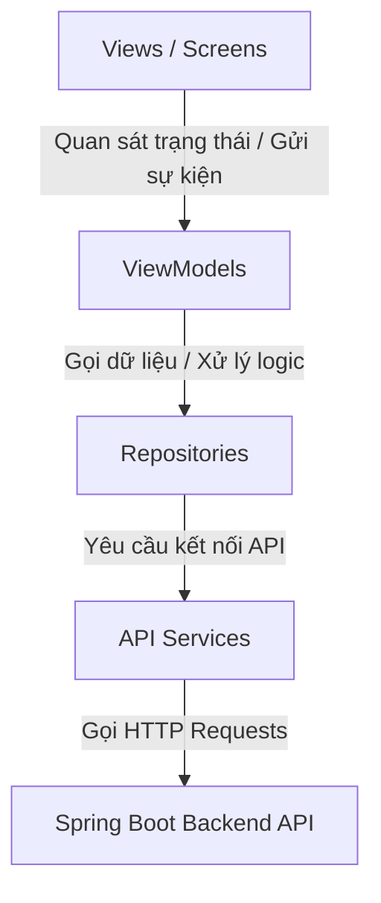

# Japanese Learning Flutter App - Project Overview & Structure

Dự án này là một ứng dụng di động học tiếng Nhật toàn diện (luyện đề thi, học từ vựng, chữ Hán, ngữ pháp và thẻ nhớ flashcards) được xây dựng bằng **Flutter**. Tài liệu này mô tả chi tiết về cấu trúc thư mục, kiến trúc thiết kế, và luồng hoạt động của mã nguồn để hỗ trợ AI/Developer nhanh chóng nắm bắt bối cảnh khi sửa lỗi hoặc phát triển tính năng mới.

---

## 1. Kiến Trúc Dự Án (Architecture Pattern)

Dự án tuân thủ kiến trúc **MVVM (Model - View - ViewModel)** kết hợp với **Repository Pattern**:



*   **Model**: Định nghĩa cấu trúc dữ liệu thô nhận từ Backend API (ví dụ: `Exam`, `ExamDetail`, `ExamPart`).
*   **View**: Thành phần giao diện người dùng (Widgets/Screens) phản hồi trực tiếp với các tương tác của người dùng.
*   **ViewModel**: Kế thừa `ChangeNotifier` từ Flutter, quản lý toàn bộ trạng thái (State) của UI và xử lý các logic tương tác, thông báo thay đổi sang View qua cơ chế `notifyListeners()`.
*   **Repository**: Lớp trung gian điều phối dữ liệu từ local (nếu có) hoặc API Service, thực hiện ánh xạ định dạng dữ liệu (Mapping) và lọc/sắp xếp phía Client.
*   **Service**: Trực tiếp gọi API HTTP (`GET`, `POST`, ...) giao tiếp với Backend Server.

---

## 2. Cấu Trúc Thư Mục Chi Tiết (`/lib`)

Thư mục chính chứa mã nguồn Flutter nằm trong `/lib`:

```
lib/
├── data/                         # Lớp dữ liệu (Data Layer)
│   ├── models/                   # Định nghĩa các Model dữ liệu & parsing JSON
│   │   ├── auth_exception.dart
│   │   ├── exam.dart             # Model đề thi (ExamResponse)
│   │   └── exam_detail.dart      # Model chi tiết đề thi & các phần (ExamDetailResponse)
│   ├── repository/               # Lớp Repository trung gian để xử lý/lọc dữ liệu
│   │   └── exam_repository.dart
│   └── service/                  # Lớp Service tương tác với các nguồn bên ngoài (API, DB)
│       └── exam_service.dart     # Service kết nối HTTP đến Spring Boot Backend
│
├── routes/                       # Quản lý điều hướng (Navigation)
│   └── app_router.dart           # Cấu hình GoRouter chính, định nghĩa AppRoutes
│
├── viewmodels/                   # Quản lý trạng thái (State Management)
│   ├── app_setting_viewmodel.dart
│   ├── auth_viewmodel.dart
│   └── exam_list_viewmodel.dart  # ViewModel danh sách đề thi (lọc, tìm kiếm, sắp xếp)
│
├── views/                        # Lớp hiển thị UI (Presentation Layer)
│   ├── account/                  # Các màn hình tài khoản & xác thực
│   │   ├── authen/               # Màn hình đăng nhập (login), đăng ký (register)
│   │   ├── news/                 # Trang tin tức
│   │   └── profile/              # Trang cá nhân, thông tin cá nhân, cài đặt bảo mật
│   ├── exam/                     # Màn hình liên quan đến Đề thi
│   │   ├── exam_detail_screen.dart # Chi tiết đề thi (gọi API lấy cấu trúc & phần thi)
│   │   └── exam_list_screen.dart   # Danh sách & bộ lọc đề thi thực tế
│   ├── exam_attempt/             # Màn hình làm bài thi trắc nghiệm trực tiếp
│   ├── exam_history/             # Lịch sử và xem lại kết quả làm bài thi
│   ├── flashcard/                # Hệ thống học từ vựng qua thẻ nhớ Flashcards
│   │   ├── create_flashcard_screen.dart # Tạo bộ thẻ mới (hỗ trợ nhập Excel/CSV)
│   │   ├── my_sets_screen.dart     # Danh sách các bộ thẻ của tôi
│   │   ├── quiz_screen.dart        # Màn hình trắc nghiệm ôn tập bộ thẻ
│   │   └── study_set_screen.dart   # Màn hình học lật thẻ flashcard
│   ├── home/                     # Màn hình chính HomeScreen (Dashboard)
│   ├── payment/                  # Cổng thanh toán mua đề thi
│   │   ├── checkout_screen.dart
│   │   └── payment_history_screen.dart
│   ├── rewards/                  # Shop đổi quà ảo (Coin, Voucher) & Điểm danh (Streak)
│   └── vocab_kanji_grammar/      # Các màn hình học tập nâng cao
│       ├── grammar_study_screen.dart
│       ├── japanese_search_screen.dart # Tra cứu từ điển tích hợp
│       ├── kanji_study_screen.dart
│       └── vocab_study_screen.dart
│
├── widgets/                      # Các Widget dùng chung trên toàn ứng dụng
│   ├── add_menu_button.dart
│   ├── app_bar.dart
│   └── app_setting.dart
│
├── firebase_options.dart         # Cấu hình Firebase cho dự án
└── main.dart                     # Điểm khởi chạy ứng dụng (Entrypoint)
```

---

## 3. Hệ Thống Điều Hướng (Routing System)

Ứng dụng sử dụng gói thư viện **`go_router`** để quản lý điều hướng giữa các màn hình, được định cấu hình tập trung trong `lib/routes/app_router.dart`. 

### Danh sách các Route chính (`AppRoutes`):
*   `/login` & `/register`: Xác thực tài khoản.
*   `/`: Trang chủ (`HomeScreen`).
*   `/exams`: Danh sách đề thi & luyện tập (`ExamListScreen`).
*   `/exams/:examId`: Chi tiết đề thi (`ExamDetailScreen`), nhận parameter ID và gọi API chi tiết.
*   `/exams/:examId/attempt`: Bắt đầu làm bài thi trắc nghiệm.
*   `/flashcards`: Danh sách các bộ thẻ nhớ flashcards.
*   `/flashcards/create`: Tạo bộ thẻ nhớ mới.
*   `/search`: Trang tra cứu từ vựng, chữ Hán, ngữ pháp.
*   `/vocab`, `/kanji`, `/grammar`: Các màn hình học từ vựng, chữ Hán và ngữ pháp.
*   `/profile`: Trang hồ sơ người dùng.

---

## 4. Công Nghệ & Các Thư Viện Sử Dụng (Tech Stack)

Khi thực hiện sửa lỗi hoặc nâng cấp tính năng cho dự án này, hãy lưu ý:
1.  **State Management**: Sử dụng `ChangeNotifier` kết hợp với kiến trúc MVVM. Các Widget lắng nghe thay đổi thông qua ViewModel hoặc cập nhật thủ công qua các luồng dữ liệu thích hợp.
2.  **API Connection**: Sử dụng gói `http` để tạo yêu cầu kết nối với Backend. Base URL tự động nhận biết chạy Emulator (Android trỏ về `http://10.0.2.2:8080`) hoặc chạy trên Web/iOS (trỏ về `http://localhost:8080`).
3.  **Firebase**: Tích hợp Firebase Core phục vụ các tính năng xác thực và lưu trữ nếu được cấu hình thêm.

---

## 5. Hướng Dẫn Dành Cho AI Khi Hỗ Trợ Fix Bug / Viết Code

Để sửa lỗi hoặc viết code đúng phong cách của dự án này, vui lòng tuân thủ các quy tắc sau:
*   **Không tự tiện dùng Fake Data**: Mọi thông tin hiển thị trên màn hình liên quan đến Đề thi (`Exam`, `ExamDetail`) đều phải bắt nguồn từ các trường dữ liệu thật trả về từ Backend API. Nếu API không trả về một trường dữ liệu nhất định, hãy ẩn Widget hiển thị trường đó đi thay vì gán giá trị mặc định (fake).
*   **Tuân thủ Luồng MVVM**: Không gọi trực tiếp `http` hay gọi trực tiếp Service từ bên trong View. Hãy viết API trong `Service` -> Khai báo qua `Repository` -> Gọi và xử lý logic cập nhật State trong `ViewModel` -> Cập nhật giao diện trong `View`.
*   **Sử dụng GoRouter**: Ưu tiên điều hướng bằng `context.push()` hoặc `context.go()` thông qua hệ thống route được định nghĩa tại `app_router.dart`. Hạn chế tối đa việc sử dụng trực tiếp các phương thức đẩy Navigator cũ (`Navigator.push`).
*   **Kiểm tra Phân Tích Code**: Sau khi thực hiện bất cứ chỉnh sửa nào, hãy đảm bảo chạy lệnh phân tích mã nguồn (`flutter analyze`) để loại bỏ các cảnh báo (warnings) hoặc lỗi cú pháp (errors) không đáng có.
